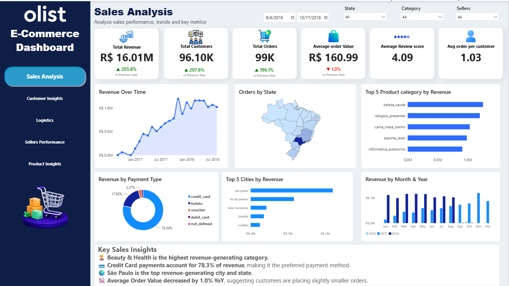
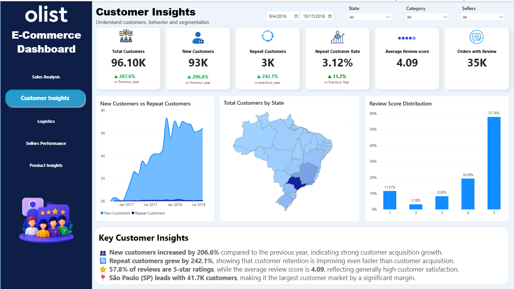
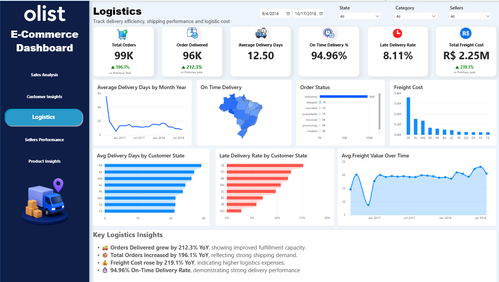
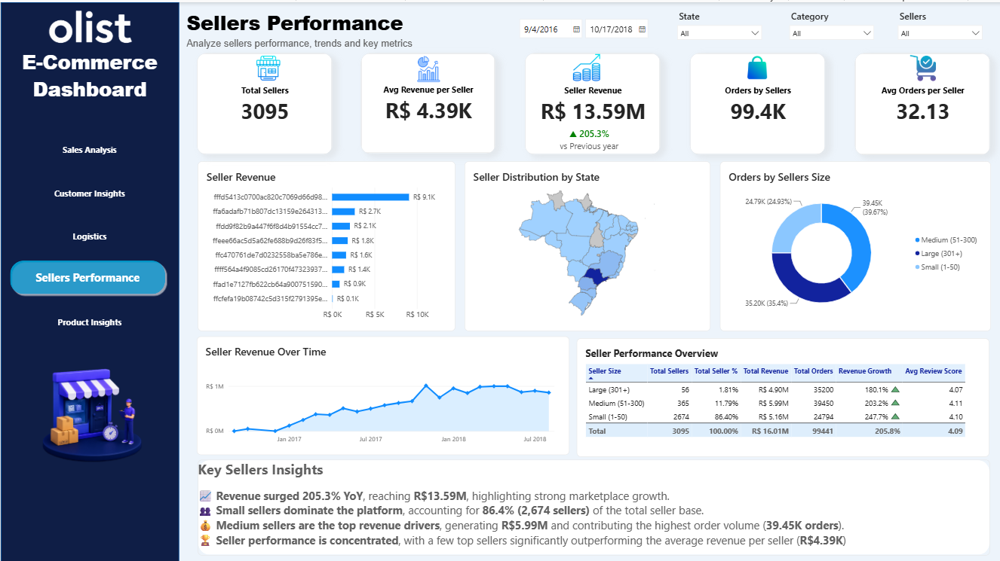
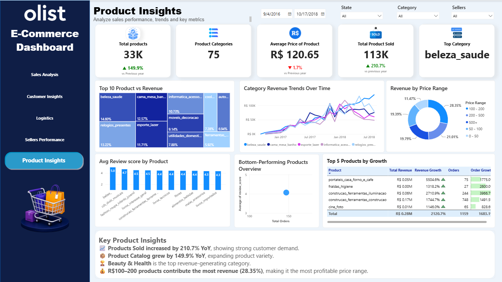

## Olist E-Commerce Analytics Dashboard
#### Project Overview
This Power BI dashboard analyzes the Olist Brazilian E-Commerce dataset and provides actionable insights across sales, customers, logistics, sellers, and products.

#### Dashboard Pages
1. Sales Analysis  
• Revenue trends  
• Order performance  
• Payment analysis  
• Top categories and cities  
2. Customer Insights  
• Customer acquisition  
• Repeat customers  
• Review analysis  
• Geographic distribution  
3. Logistics  
• Delivery performance  
• Freight cost analysis  
• On-time delivery tracking  
• State-wise logistics metrics  
4. Sellers Performance  
• Seller revenue analysis  
• Seller segmentation  
• Growth trends  
• Geographic distribution  
5. Product Insights  
• Category performance  
• Product growth analysis  
• Price range contribution  
• Product review scores

#### Key Metrics

| Metric | Value |
|---------|---------|
| 💰 Revenue | R$ 16.01M |
| 🛒 Orders | 99K |
| 👥 Customers | 96K |
| 📦 Products Sold | 113K |
| 🚚 On-Time Delivery | 94.96% |
| ⭐ Average Review Score | 4.09 |

#### Tools Used
• Power BI  
• Power Query  
• DAX  
• Data Modeling  

#### Dashboard Preview

### Sales Analysis

### Customer Insights

### Logistics

### Sellers Performance

### Product Insights

#### Key Business Insights
- Beauty & Health emerged as the highest revenue-generating category.
- Credit Card payments accounted for 78.3% of total revenue.
- São Paulo was the leading state and city by revenue.
- On-Time Delivery Rate reached 94.96%.
- Customer satisfaction remained high with an average review score of 4.09.

#### Skills Demonstrated
- Data Cleaning & Transformation
- Data Modeling
- DAX Measures & Calculations
- KPI Development
- Interactive Dashboard Design
- Business Intelligence & Storytelling
